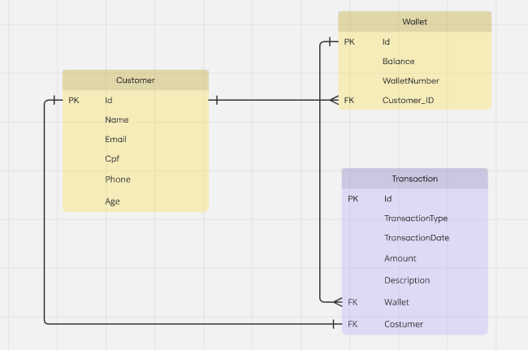

# Online Payment wallet Application REST-API

REST API for an online payment wallet application that can be used by customers to manage balance by crediting or debiting directly to the wallet and transferring amounts between wallets.

## REST API Use for below functions
- Create Wallet: Allow the creation of wallets for users.
- Retrieve Balance: Retrieve the current balance of a user's wallet.
- Retrieve Historical Balance: Retrieve the balance of a user's wallet at a specific point in the past.
- Deposit Funds: Enable users to deposit money into their wallets.
- Withdraw Funds: Enable users to withdraw money from their wallets.
- Transfer Funds: Facilitate the transfer of money between user wallets.

## Tech Stack
- Java 17
- Hibernate
- Spring Boot with JPA
- PostgreSQL
- Maven
- Lombok
- RSQL
- Swagger UI

## ER Diagram
The following ER diagram indicates the database tables and the interactions they were using.
